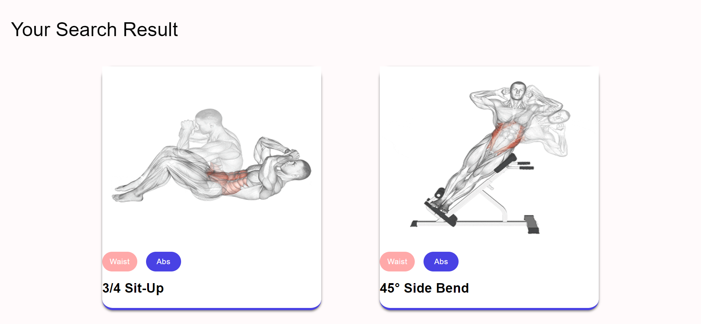

# Fitness360 React App

Welcome to Fitness360! This React-based web application is your ultimate destination for a variety of workout routines, each accompanied by YouTube video links for clear, visual guidance. Whether you're a fitness enthusiast or a beginner, Fitness360 provides targeted exercise recommendations for different body parts. You can experience the app live at [https://fitness360.netlify.com](https://fitness360.netlify.com).





## Table of Contents

- [About the App](#about-the-app)
- [Features](#features)
  - [Search by Body Part](#search-by-body-part)
- [Installation](#installation)
- [Usage](#usage)
- [Contributing](#contributing)
- [License](#license)

## About the App

Fitness360 is a React-powered web application designed to cater to various fitness needs. It offers a curated collection of workout routines, each tailored to specific body parts, along with accompanying YouTube video links for comprehensive visual guidance. Whether you're aiming to build strength, tone muscles, or stay active, Fitness360 has the perfect exercise routines for you.

The app's intuitive interface ensures that users of all experience levels can easily navigate and benefit from its features.

## Features

### Search by Body Part

- **Customized Workouts:** Users can explore workout routines that target specific body parts, such as arms, legs, core, and more.

- **Exercise Details:** Each exercise comes with detailed instructions to ensure proper form and execution.

- **YouTube Video Links:** Fitness360 provides YouTube video links alongside each exercise, offering visual demonstrations for a better understanding of the movements.

- **Variety of Exercises:** With a diverse range of exercises for each body part, users can create varied and effective workout routines.

- **Visual Reference:** Images or videos for each exercise give users a clear visual guide for correct performance.

## Installation

To run this project locally, follow these steps:

1. **Clone the repository:**

    ```bash
    git clone https://github.com/Abdul-Samad-01/fitness360-react-app.git
    ```

2. **Navigate to the project directory:**

    ```bash
    cd fitness360
    ```

3. **Install dependencies:**

    ```bash
    npm install
    ```

4. **Start the development server:**

    ```bash
    npm start
    ```

5. **Open your browser:**

    Visit [http://localhost:3000](http://localhost:3000) to view the app locally.

## Usage

Explore the deployed version of the app at [https://fitness360.netlify.com](https://fitness360.netlify.com) to access workout routines for your desired body parts. Each exercise includes a YouTube video link for clear visual guidance.

## Contributing

Your contributions to Fitness360 are highly appreciated. If you want to add new exercises, enhance the user interface, or address issues, please feel free to submit a pull request.

1. Fork the repository.
2. Create a new branch.
3. Implement your enhancements or fixes.
4. Open a pull request, outlining your changes.

## License

This project is licensed under the [MIT License](LICENSE).

---

Thank you for choosing Fitness360 as your fitness companion. We're here to help you achieve your fitness goals with tailored exercise routines and visual guidance. Should you encounter any challenges or have suggestions, don't hesitate to reach out. Get ready to embark on a journey of fitness and well-being! 💪🏋️‍♀️📺